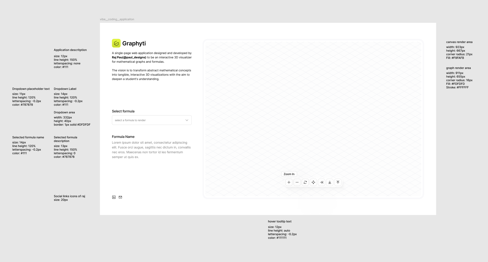

# CLAUDE.md

This file provides guidance to Claude Code (claude.ai/code) when working with code in this repository.

# Base Instructions:
- always analyze the request and reply with how the implementation is going to be
- always ask for permission to code after analysis and implementation plan is done

## Project Overview

Graphyti is an interactive 3D visualizer for mathematical graphs and formulas built by Raj Paul (@paul_designs). The goal is to transform abstract mathematical concepts into tangible, interactive 3D visualizations to enhance student understanding.

## Technology Stack

This is a React + TypeScript + Vite application with:
- **Frontend**: React 19, TypeScript, Material-UI (MUI)
- **3D Visualization**: Three.js with React Three Fiber and Drei
- **Mathematics**: math.js for mathematical operations
- **Build Tool**: Vite with SWC for fast compilation
- **Linting**: ESLint with TypeScript and React plugins

## Development Commands

```bash
# Development server with hot reload
npm run dev

# Production build (compiles TypeScript then builds)
npm run build

# Lint code with ESLint
npm run lint

# Preview production build locally
npm run preview
```

## Architecture Notes

- **Entry Point**: `src/main.tsx` renders the React app into `index.html`
- **Main Component**: `src/App.tsx` (currently contains boilerplate, will be the main 3D graph visualizer)
- **Build Pipeline**: TypeScript compilation followed by Vite bundling
- **Dependencies**: Heavy focus on 3D rendering (@react-three/fiber, @react-three/drei, three) and mathematical operations (mathjs)

## Key Dependencies for 3D Math Visualization

- `@react-three/fiber`: React renderer for Three.js
- `@react-three/drei`: Helper components for React Three Fiber
- `three`: Core 3D graphics library
- `mathjs`: Mathematical expression parser and evaluator
- `@mui/material`: UI components and theming


# Documentation websites for the installed libraries
Three.js: threejs.org/docs/
React Three Fiber: docs.pmnd.rs/react-three-fiber
Drei: github.com/pmndrs/drei
Material-UI (MUI): mui.com/material-ui/getting-started/
math.js: mathjs.org/docs/


# Notes:
    viewport width(max): 1440px
    viewport height: 100VH
    icon size: 16px 
    icon bounding box: 30px
    user control panel width, height: 242px, 38px
    logo-text: 24px, semi-bold, -0.2px letter spacing, line height auto 


Image with typography and icon size specifications:

Has ground plane grid displayed in the graph render area


Image with typography and icon size specifications:


**Phase 1: Minimum Viable Product (MVP)**

F1.1: Pre-defined Graph Library: A dropdown menu to select from a curated list of foundational 3D graphs. 

F1.2: 3D Visualization Canvas:
A dedicated, large area of the screen where the selected graph is rendered.

F1.3: Core Camera Controls:
Rotate: 360-degree orbital rotation of the camera around the graph using mouse controls.
Zoom: Zoom in and out on the graph using mouse controls.
Pan: Move the camera's viewpoint left, right, up, and down using mouse controls.

F1.4: Axes and Grid Display:
Display of labeled X, Y, and Z axes and a ground plane grid to provide spatial context.

F1.5: Formula Display:
The mathematical formula for the currently displayed graph is always visible on-screen.


The current App.tsx contains Vite boilerplate code that will need to be replaced with the actual 3D graph visualization implementation.